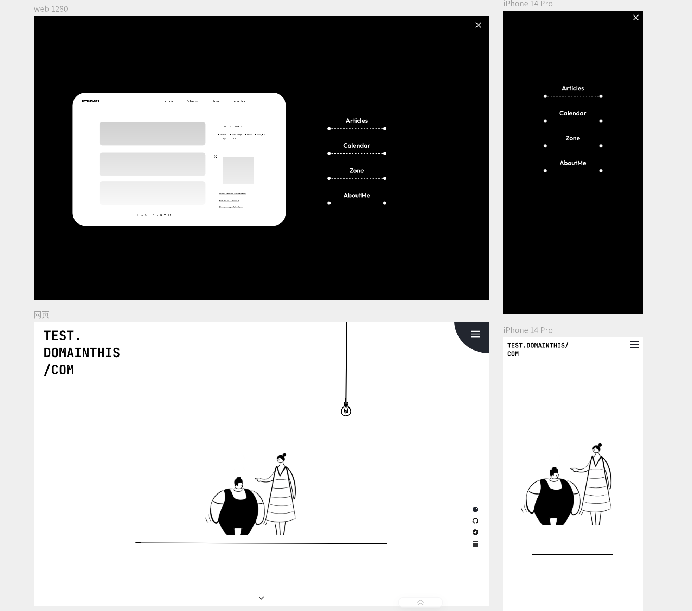
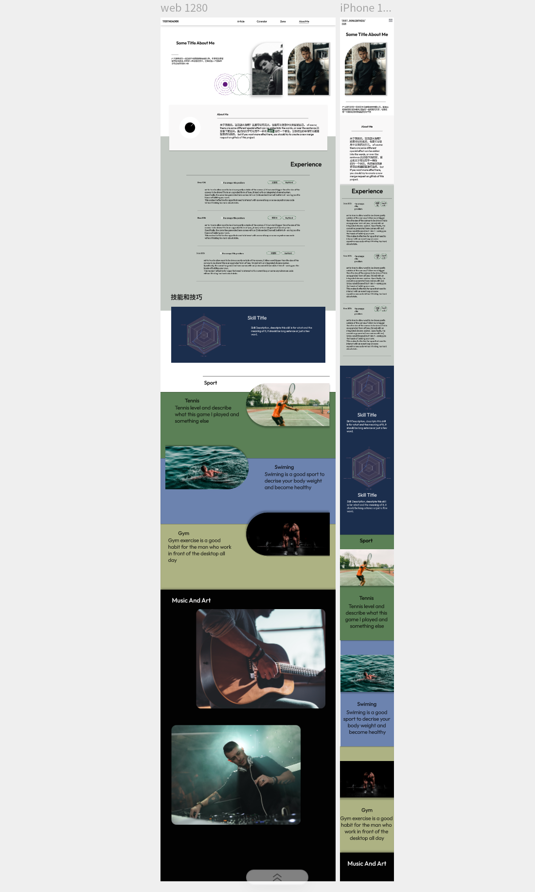
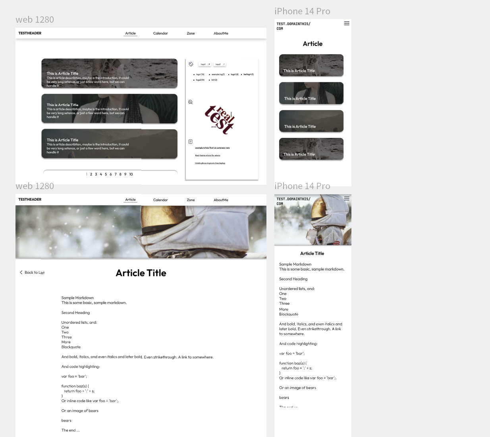
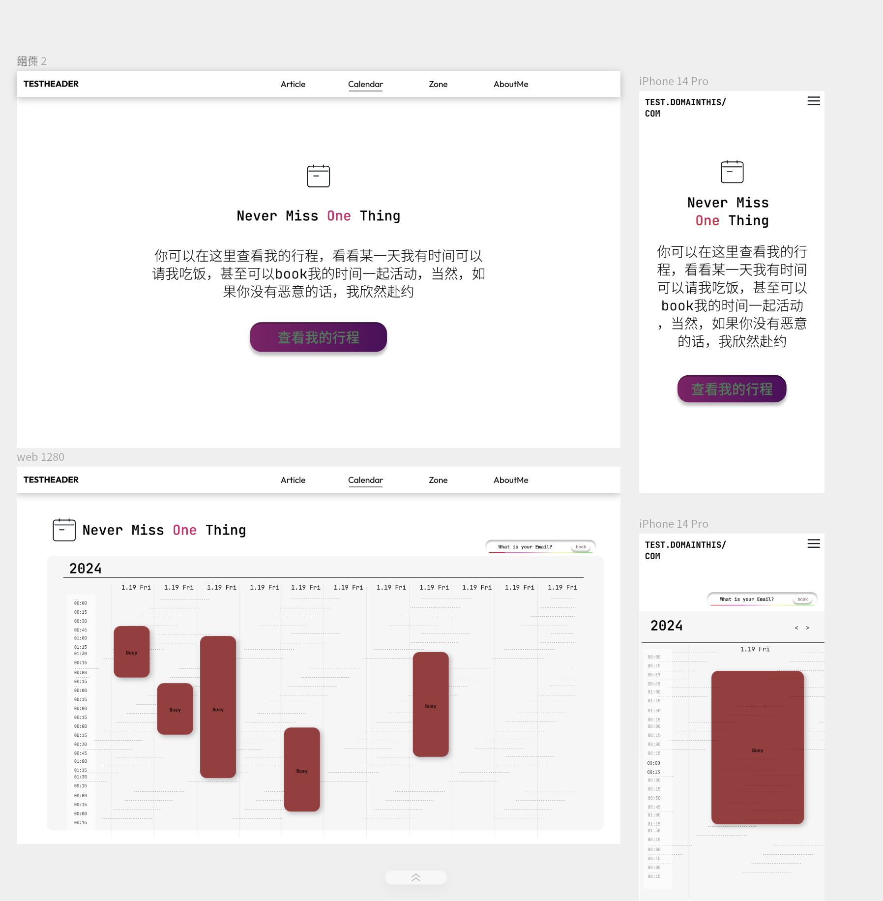

# This is a Website frontEnd page framework

Under construction now.

install

`cargo install dioxus-cli`

run:

### `dx serve --hot-reload`

Builds the app for production to the `build` folder.\
It correctly bundles React in production mode and optimizes the build for the best performance.

### screenshot 

[LICENSE-APACHE.txt](..%2F..%2FDownloads%2FLICENSE-APACHE.txt)
